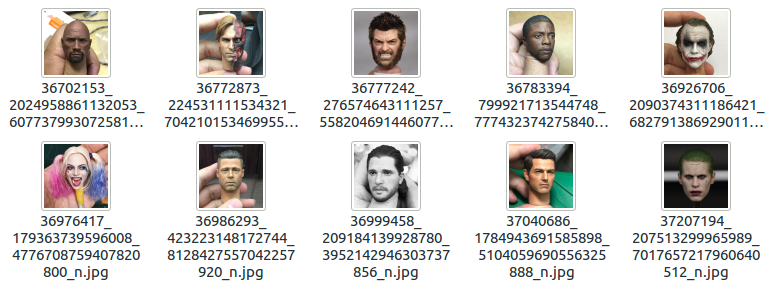

<p align="center">
<br>
	<a href="https://www.npmjs.com/migger"></a>
	<br>
	<br>
	<a href="https://travis-ci.org/CodeDotJS/migger"></a>
	
</p>


<p align="center"><b>Download media from the URL that contains multiple images/videos on Instagram!</b></p>


## Install

```

$ npm install --global migger
```
__`OR`__
```
$ sudo npm install --global migger
```

## Usage


```
 Usage: mig <command> [url] <option>

 Command:
  -d, --download    Download all the media
  -e, --export      Export links in as JSON

 Option:
  -p, --path        Specify path of the folder for files

  Help:
  -h, --help        Show help
  -v, --version     Show current version

```


## Preview

<p align="center">


<br>
<br>



</p>

__NOTE__

- By default, the saved media can be found in `/user/home/instagram/`. There is no way to change the destination permanently.

- You can use `$ mig -d <url> --path /path/to/download` to specify the destination of the folder. The default directory will always be `/path/to/download/Instagram`.

- Exported JSON files will be automatically saved in `/user/home/instagram` with a random name!

__WHY?__

- I don't know. I was stressed, so made it for fun. That's it.

## Related

- __[`instavim`](https://github.com/CodeDotJS/instavim)__ `:` `Complete media downloader for Instagram`
- __[`mista`](https://github.com/CodeDotJS/mista)__ `:` `Scrape all downloadable urls of the Instagram posts that has multiple images or videos!`
- __[`instagram-profile-picture`](https://github.com/CodeDotJS/instagram-profile-picture)__ `:` `Get url to the profile picture of any instagram user in different resolutions and more!`
- __[`instagram-links`](https://github.com/CodeDotJS/Instagram-Links)__ `:` `Get links of the publicaly shared medias and profile picture available on Instagram!`
- __[`instafy`](https://github.com/CodeDotJS/instafy)__ `:` `A command line Instagram media notifier!`
- __[`istalk`](https://github.com/CodeDotJS/istalk)__ `:` `Don't pollute your browser history. Stalk Instagram users from the command line!`
- __[`image-of`](https://github.com/CodeDotJS/image-of)__ `:` `Download profile picture of any facebook user!`
- __[`gravatar-of`](https://github.com/CodeDotJS/gravatar-of)__ `:` `Download avatar of gravatar users through their email id!`
- __[`twiger`](https://github.com/CodeDotJS/twiger)__ `:` `A complete media downloader for twitter!`

## License

MIT - Copyright &copy; [Rishi Giri](http://rishi.ml)
